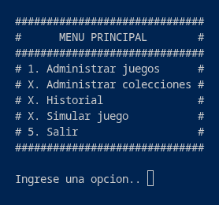
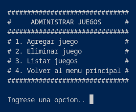
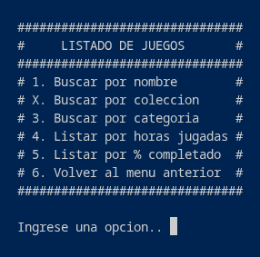

# __MODULE-3__
## Proyecto Modulo 3: Fundamentos de programacion en python.
### La aplicacion consiste en la administracion de juegos que posee un usuario.
 

## __Instalacion__:
### 1. Crear un directorio en el cual se albergara la aplicacion.
### 2. Ingresar al directorio (por consola).
### 3. Ejecutar el comando (sin comillas) 'git clone https://github.com/Sence-Courses/module-3.git'
### 4. Ejecutar el comando (sin comillas) 'git checkout develop'
 

## __Ejecucion__:
### Una vez cumplidos los pasos del proceso de instalacion y estando en la carpeta de la aplicacion ejecutar el comando (sin comillas) 'python mod3'
 

## __Modo de uso__:
### La aplicacion consiste en menus anidados los cuales se navegan a traves de las opciones mostradas.
### A continuacion se muestran estos menus y sus funcionalidades de manera detallada.
> Las opciones con X no estan implementadas.

### __Menu principal__

#### Opcion 1: Dirige al menu de [administracion de juegos](#menu-administrar-juegos)
#### Opcion 2: No implementada.
#### Opcion 3: No implementada.
#### Opcion 4: No implementada.
#### Opcion 5: Permite salir de la aplicacion.
 

### __Menu Administrar juegos__

#### Opcion 1: Permite ingresar a la pantalla de [agregar juego](images/ingresar_juego.png).
#### Opcion 2: Permite ingresar a la pantalla de [eliminar juego](images/eliminar_juego.png).
#### Opcion 3: Permite ingresar al menu de [listado de juegos](#menu-listado-de-juegos).
#### Opcion 4: Permite retornar al [menu principal](#menu-principal).
 

### __Menu Listado de juegos__

#### Opcion 1: Permite acceder a la pantalla de [busqueda por nombre](images/busqueda_por_nombre.png).
#### Opcion 2: No implementada.
#### Opcion 3: Permite acceder a la pantalla de [busqueda por categoria](images/busqueda_por_categoria.png).
#### Opcion 4: Permite ingresar a la pantalla de [listado de juegos por horas acumuladas](images/listado_por_horas.png).
#### Opcion 5: Permite ingresar a la pantalla de [listado de juegos por porcetaje de completado](images/listado_por_avance.png).
#### Opcion 6: Permite retornar al menu de [administrar juegos](#menu-administrar-juegos).

